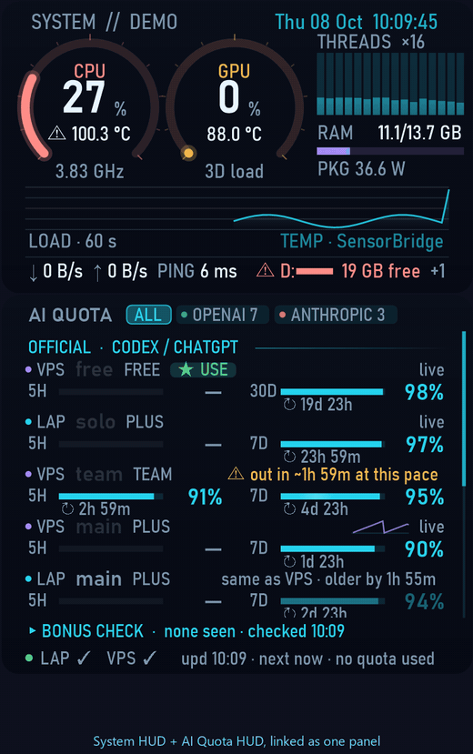

# system-hud-widget

A small sci-fi system monitor for the Windows desktop: CPU and GPU load rings with temperature, per-thread load bars, RAM, CPU / whole-PC power, a 60-second load graph, network speed, ping, free space on every drive and a clock. Built with **Claude Code (Claude Opus 5.5)**.


**[⬇ Download the latest release](https://github.com/Pakapong26/system-hud-widget/releases/latest)** (prebuilt, no build needed) · [What's new](CHANGELOG.md)

> ไทย: ดูหัวข้อ [ภาษาไทย](#ภาษาไทย) ด้านล่าง · 中文：见下方 [简体中文](#简体中文) · Tracking AI coding quotas? See [ai-quota-hud](https://github.com/Pakapong26/ai-quota-hud).

## Features

- CPU / GPU rings turn amber at 75 °C and red at 90 °C (with ⚠); warning colours stay the same in every theme
- Per-thread bars (any core count), RAM bar, CPU + GPU history graph
- Bottom strip: ↓ / ↑ network speed, **ping** (1.1.1.1 every 5 s, `HUD_PING_HOST` to change) and **free space on every drive** (⚠ when nearly full, `+N` when more drives exist, hover for the full list)
- **Click to switch**: the drive name → next drive · the number → free / used of total · a temperature → °C / °F · **PKG** → CPU package power / **SYS** whole-PC power (read from the battery, so only while unplugged; on an APU the package already includes the built-in GPU)
- 8 colour themes, font picker, glass / tinted / solid / floating backgrounds, frame full / subtle / none, panel and whole-widget opacity
- Readable when small: below ~80 % the labels keep a readable size
- Resize with Ctrl + mouse wheel, by dragging the bottom-right corner, or from the menu (60 to 220 %)
- **Pin to desktop** like Rainmeter's "On desktop" (stays after Win+D), or Always on top
- °C / °F, show or hide threads, graph and clock, start with Windows
- Light by design: one refresh a second, Windows performance counters (no admin), smooth easing between readings
- Plain WinForms (.NET 8) on a per-pixel-alpha window, no Electron, no browser


## Use them together as one panel

[System HUD](https://github.com/Pakapong26/system-hud-widget) and [AI Quota HUD](https://github.com/Pakapong26/ai-quota-hud) are made to sit together:



*(AI quota rows use demo data)*

- Drag one close to the other: it **snaps** edge to edge
- Right-click → **Group with …** → **Linked**: move and resize together; stacked, AI Quota HUD takes the HUD's width so the two read as one panel, with a single clock and the date on top
- **Same colours + font**: theme, background, opacity, frame and font follow each other (turn it off to style them separately); **Split apart** to go back to two widgets
- Right-click → Background → **Frame: none** for a borderless look

## Build and run

Needs the .NET 8 SDK on Windows 10/11.

```
dotnet publish -c Release -o publish
publish\HudWidget.exe
```

Right-click the widget for every option. Set `HUD_LABEL` to change the title (it shows the computer name by default).

## Temperatures

Windows does not expose CPU/GPU temperatures without a driver. Either:

1. run [LibreHardwareMonitor](https://github.com/LibreHardwareMonitor/LibreHardwareMonitor) with its web server on port 8085, or
2. build `bridge/SensorBridge.cs` next to `LibreHardwareMonitorLib.dll` (.NET Framework 4 compiler) and run it as admin; it writes `%ProgramData%\HudWidget\sensors.txt` once a second, no window, no network.

Without either, the HUD still shows load, RAM and the graph.

**Starting with Windows from Task Scheduler** (e.g. SensorBridge, which needs admin)? Untick *Stop if the computer switches to battery power* and *Stop the task if it runs longer than 3 days*, or Windows closes it when the laptop wakes up or the charger is unplugged.

## How light is it?

Measured on a 16-thread laptop (60-second average, both widgets running side by side, animations on):

| Process | CPU (share of the whole PC) | RAM |
|---|---|---|
| AI Quota HUD | about 1-2 % | about 70 MB |
| System HUD | about 0.8 % | about 85 MB |
| SensorBridge (optional, temperatures) | about 0.1 % | about 27 MB |

Want it lighter?
- Right-click → **Show → Animations** off: the biggest saving; the widget then only redraws when a value changes
- AI Quota HUD: **Refresh every** 10 or 30 min (the collector runs once per refresh); Lite edition instead of Full
- System HUD: hide the **60 s history graph** or **Threads + memory**; turn off **Network, ping + disk** if you do not need it
- Close SensorBridge if you do not need temperatures

## Feedback and ideas

Want a feature or found a bug? Tell me either way, all ideas welcome:

- GitHub: [open an issue](https://github.com/Pakapong26/system-hud-widget/issues)
- X (Twitter): mention or DM [@Pakapong26](https://x.com/Pakapong26)

## ภาษาไทย

วิดเจ็ตดูสถานะเครื่องสไตล์ไซไฟสำหรับ Windows ทำด้วย **Claude Code**

- วงแหวนโหลด CPU/GPU พร้อมอุณหภูมิ (เหลืองที่ 75 °C, แดงที่ 90 °C), แถบโหลดรายเธรด, RAM, กำลังไฟ CPU, กราฟ 60 วินาที
- แถวล่าง: ความเร็วเน็ต ↓/↑, PING (ทุก 5 วินาทีไปที่ 1.1.1.1), พื้นที่ว่างทุกไดรฟ์ (ใกล้เต็มขึ้น ⚠, ชี้เมาส์ดูครบทุกไดรฟ์)
- คลิกสลับได้: คลิกชื่อไดรฟ์เพื่อเปลี่ยนไดรฟ์, คลิกตัวเลขเพื่อสลับ "เหลือ" / "ใช้ไป/ทั้งหมด", คลิกอุณหภูมิเพื่อสลับ °C / °F, คลิก PKG เพื่อสลับกำลังไฟซีพียู / ทั้งเครื่อง (SYS วัดได้เฉพาะตอนใช้แบต)
- เลือกฟอนต์, กรอบ (เต็ม / จาง / ไม่มี) และใช้คู่กับ AI Quota HUD เป็นแผงเดียว (Group: ลากและย่อขยายพร้อมกัน สีเดียวกัน)
- 8 ธีม, ปรับพื้นหลังและความโปร่งใส, ย่อขยายด้วย Ctrl+ลูกกลิ้งหรือลากมุม, ปักบนเดสก์ท็อปแบบ Rainmeter
- เบาเครื่อง อัปเดตวินาทีละครั้ง ไม่ต้องใช้สิทธิ์แอดมิน (ยกเว้นตัวอ่านอุณหภูมิ)

ติดตั้ง: ลง .NET 8 SDK แล้วรัน `dotnet publish -c Release -o publish` คลิกขวาที่วิดเจ็ตเพื่อตั้งค่า

**อยากได้ฟีเจอร์อะไรหรือเจอบั๊ก** บอกได้ทั้ง [เปิด issue บน GitHub](https://github.com/Pakapong26/system-hud-widget/issues) หรือแท็ก / DM มาที่ X [@Pakapong26](https://x.com/Pakapong26) ยินดีรับทุกไอเดียครับ

**กินเครื่องแค่ไหน:** วัดบนโน้ตบุ๊ก 16 เธรด เปิดคู่กัน มีแอนิเมชัน: AI Quota HUD ราว 1-2% CPU / 70 MB, System HUD ราว 0.8% / 85 MB, SensorBridge ราว 0.1% / 27 MB อยากให้เบาลง: ปิด Animations (ลดได้มากสุด), ตั้ง Refresh every 10-30 นาที, ใช้รุ่น Lite, ซ่อนกราฟหรือแถวเน็ต และปิด SensorBridge ถ้าไม่ต้องการอุณหภูมิ

## 简体中文

科幻风格的 Windows 桌面系统监视小部件，使用 **Claude Code** 制作。

- CPU / GPU 负载圆环与温度（75 °C 变黄，90 °C 变红并显示 ⚠），每个线程的负载条，内存，60 秒负载曲线
- 底部一行：↓/↑ 网速、PING（每 5 秒 ping 一次 1.1.1.1）、硬盘剩余空间（所有本地硬盘，快满时显示 ⚠；鼠标悬停可查看全部硬盘）
- 可点击切换：点击盘符切换到下一个硬盘，点击数字在「剩余」和「已用/总量」之间切换；点击温度在 °C / °F 之间切换；点击 PKG 在 CPU 封装功耗与整机功耗（SYS，仅在使用电池时可测）之间切换
- 右键菜单：8 个主题、字体选择、背景与透明度、边框（完整 / 淡 / 无）、缩放（Ctrl+滚轮或拖动右下角）、固定在桌面（类似 Rainmeter）
- 与 [AI Quota HUD](https://github.com/Pakapong26/ai-quota-hud) 组合使用：拖近时自动吸附，「Group」模式下一起移动和缩放，并可共用颜色与字体，看起来像一个面板
- 资源占用很小：约 0.8 % CPU、85 MB 内存（16 线程笔记本实测）。关闭动画可进一步降低

安装：安装 .NET 8 SDK，运行 `dotnet publish -c Release -o publish`，右键小部件进行设置。温度需要以管理员身份运行 SensorBridge。

**想要新功能或发现 bug？** 欢迎在 GitHub [提交 issue](https://github.com/Pakapong26/system-hud-widget/issues)，或在 X 上 @ / 私信 [@Pakapong26](https://x.com/Pakapong26)。

## License

MIT. Made with [Claude Code](https://claude.com/claude-code).
