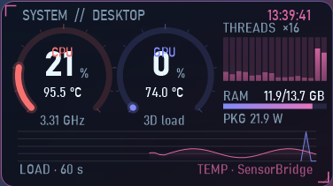
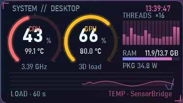

# system-hud-widget

A small sci-fi system monitor for the Windows desktop: CPU and GPU load rings with temperature, per-thread load bars, RAM, CPU package power, a 60-second load graph and a clock. Built with **Claude Code (Claude Opus 5.5)**.



> ไทย: ดูหัวข้อ [ภาษาไทย](#ภาษาไทย) ด้านล่าง · Tracking AI coding quotas? See [ai-quota-hud](https://github.com/Pakapong26/ai-quota-hud).

## Features

- CPU / GPU rings turn amber at 75 °C and red at 90 °C
- Per-thread bars (any core count), RAM bar, CPU package watts, CPU + GPU history graph
- 7 colour themes, glass / tinted / solid / floating backgrounds, panel and whole-widget opacity
- Resize with Ctrl + mouse wheel, by dragging the bottom-right corner, or from the menu (60 to 220 %)
- **Pin to desktop** like Rainmeter's "On desktop" (stays after Win+D), or Always on top
- °C / °F, show or hide threads, graph and clock, start with Windows
- Light by design: one refresh a second, Windows performance counters (no admin), smooth easing between readings
- Plain WinForms (.NET 8) on a per-pixel-alpha window, no Electron, no browser



## Build and run

Needs the .NET 8 SDK on Windows 10/11.

```
dotnet publish -c Release -o publish
publish\HudWidget.exe
```

Right-click the widget for every option. Set `HUD_LABEL` to change the title (it shows the computer name by default).

## Temperatures

Windows does not expose CPU/GPU temperatures without a driver. Either:

1. run [LibreHardwareMonitor](https://github.com/LibreHardwareMonitor/LibreHardwareMonitor) with its web server on port 8085, or
2. build `bridge/SensorBridge.cs` next to `LibreHardwareMonitorLib.dll` (.NET Framework 4 compiler) and run it as admin; it writes `%ProgramData%\HudWidget\sensors.txt` once a second, no window, no network.

Without either, the HUD still shows load, RAM and the graph.

## ภาษาไทย

วิดเจ็ตดูสถานะเครื่องสไตล์ไซไฟสำหรับ Windows ทำด้วย **Claude Code**

- วงแหวนโหลด CPU/GPU พร้อมอุณหภูมิ (เหลืองที่ 75 °C, แดงที่ 90 °C), แถบโหลดรายเธรด, RAM, กำลังไฟ CPU, กราฟ 60 วินาที
- 7 ธีม, ปรับพื้นหลังและความโปร่งใส, ย่อขยายด้วย Ctrl+ลูกกลิ้งหรือลากมุม, ปักบนเดสก์ท็อปแบบ Rainmeter
- เบาเครื่อง อัปเดตวินาทีละครั้ง ไม่ต้องใช้สิทธิ์แอดมิน (ยกเว้นตัวอ่านอุณหภูมิ)

ติดตั้ง: ลง .NET 8 SDK แล้วรัน `dotnet publish -c Release -o publish` คลิกขวาที่วิดเจ็ตเพื่อตั้งค่า

## License

MIT. Made with [Claude Code](https://claude.com/claude-code).
